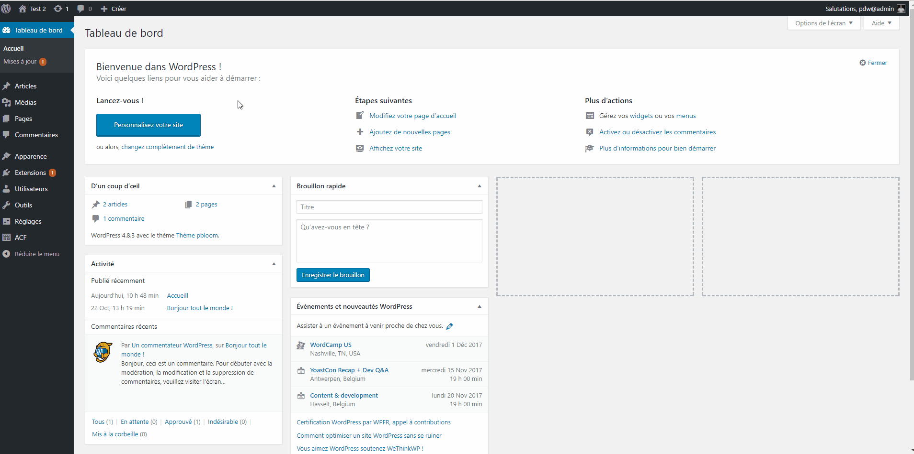
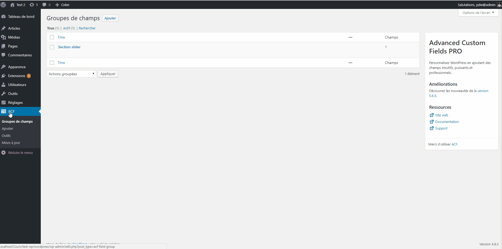
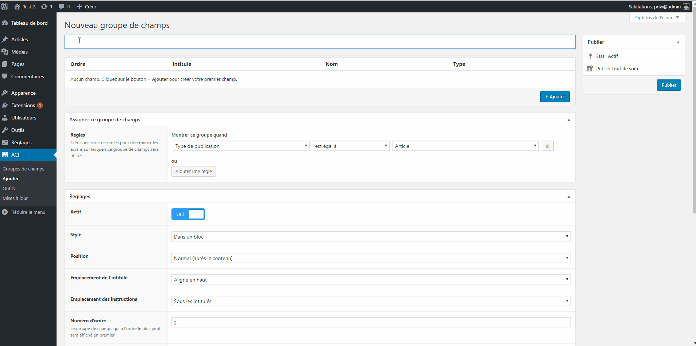
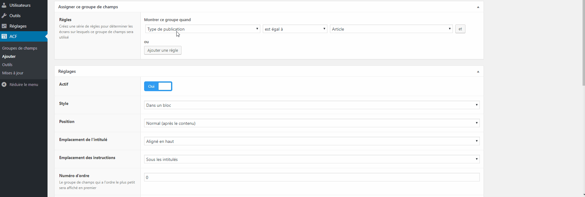
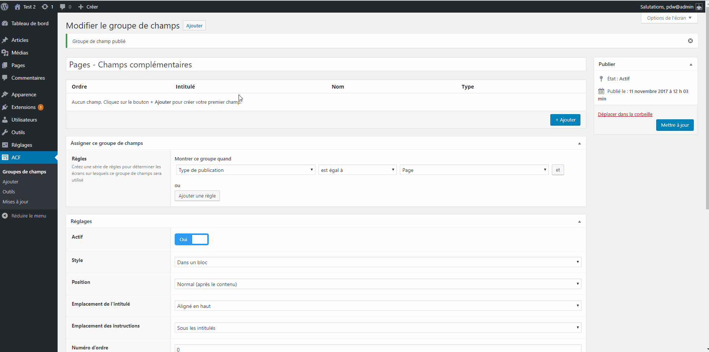
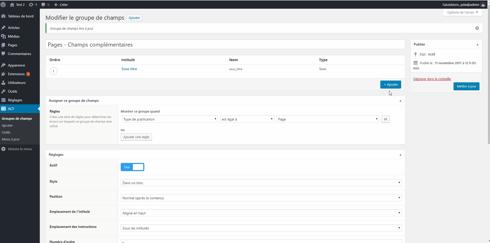
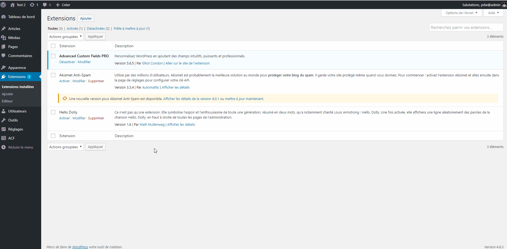

# Création de nouveaux champs

Les champs de bases dans WordPress sont le titre, le contenu (wysiwyg), l’image à la une, catégories, etc...

Cependant, il est possible de créer des nouveaux champs différents de ceux de base dans WordPress à l'aide du plugin [ACF](https://www.advancedcustomfields.com/).
Ces nouveaux champs peuvent être lié à une page, un type de page, un template, un article, etc...

Les instructions qui suivent par du principe que vous possédez la version **PRO d'ACF**.

Cependant, vous avez déjà beaucoup de fonctionnalités avec la version gratuite!

## Téléchareger & installer ACF PRO

Vous troverez le lien ci-dessous.

[ACF PRO](https://www.advancedcustomfields.com/pro/)

## Créer un groupe de champs

### 1. Cliquer sur l'onglet ACF ou Custom fieds

### 2. Cliquer sur le bouton Ajouter

### 3. Remplir le champ titre

**Celui-ci est très important et doit être le plus explicite possible.**

### 4. Choisissez à qui vos champs seront liés (règles)

Les règles sont très importantes !

Elles permettent de liées les champs un type de contenu :

- A toutes les pages
- A tous les articles
- A un template
- Etc...

### 5. Cliquer sur + Ajouter pour ajouter les champs

- Champ texte

- Champ WYSIWYG

### Démonstration complète

---

[:back:](fields.md) | [:soon:](template-custom.md)