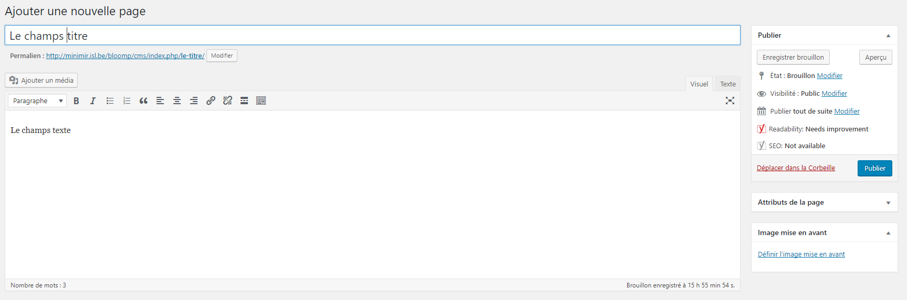
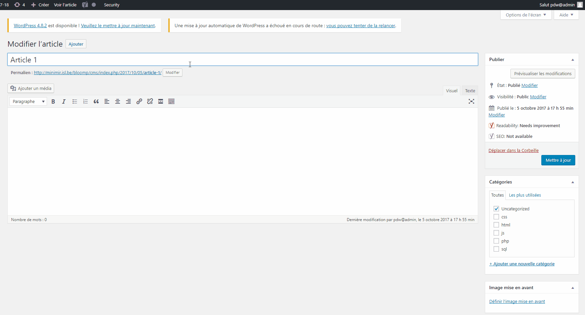
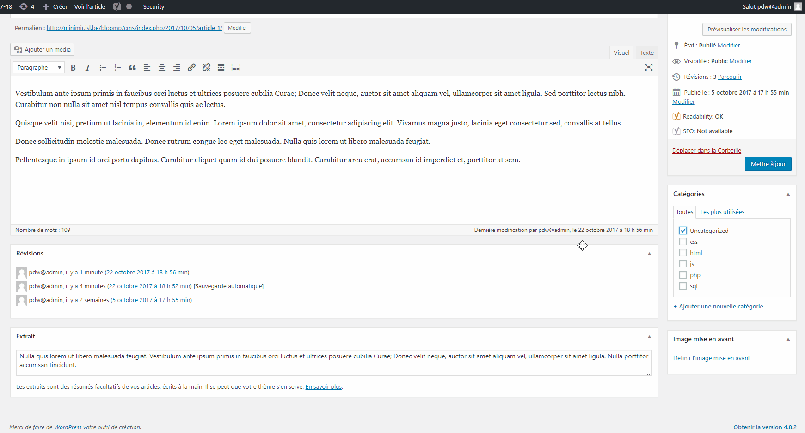

# Les champs de bases

## Les pages



- le champ titre

    Utilisation : 
    
    ````php
    <?php echo get_the_title(); ?>
    ````  
      
    ````php
    <?php the_title(); ?>
    ````
    
- le permalien (le chemin url pour arriver à votre page)

  Utilisation :
  
  ````php
  <?php echo get_permalink(); ?>


- le champ texte

  Utilisation :
  
  ````php
  <?php echo get_the_content(); ?>


- le champ image

  Utilisation avec balise ```` :
  
  ````php
  <?php echo get_the_post_thumbnail( get_the_ID(), 'thumbnail' ); ?>
  ````
  
  Utilisation avec URL :
  
  ````php
  <?php echo wp_get_attachment_image_src(get_post_thumbnail_id(), 'thumbnail', true)[0]; ?>
  ````
    

## Les articles (post)

- le champ titre

    Utilisation : 
    
    ````php
    <?php echo get_the_title(); ?>
    ````  
      
    ````php
    <?php the_title(); ?>
    ````
    
- le permalien (le chemin url pour arriver à votre page)

  Utilisation :
  
  ````php
  <?php echo get_permalink(); ?>


- le champ texte

  Utilisation :
  
  ````php
  <?php echo get_the_content(); ?>


- le champ résumé (extrait)

  

  Utilisation :
  
  ````php
  <?php echo get_the_excerpt(); ?>


- le champ image

  Utilisation avec balise ```` :
  
  ````php
  <?php echo get_the_post_thumbnail( get_the_ID(), 'thumbnail' ); ?>
  ````
  
  Utilisation avec URL :
  
  ````php
  <?php echo wp_get_attachment_image_src(get_post_thumbnail_id(), 'thumbnail', true)[0]; ?>
  ````

- le nom de l'auteur

  Utilisation :
  
  ````php
  <?php echo get_the_author(); ?>
  ````

- le date de création

  Utilisation :
  
  ````php
  <?php echo get_the_date( 'l F j, Y' ); ?>
  ````


- Les champs catégories

  

  Utilisation :
  
  ````php
  <?php get_the_category(); ?>
  ````
  
  **Attention, cette fonction retourne un tableau avec des objets donc il faut faire un ``foreach``**


# Les champs customs


---

[:back:](analyse-template.md) | [:soon:](template-custom.md)

