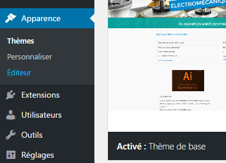
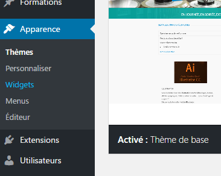
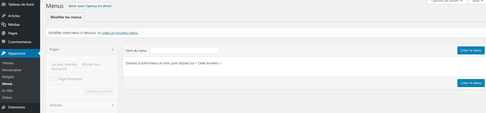
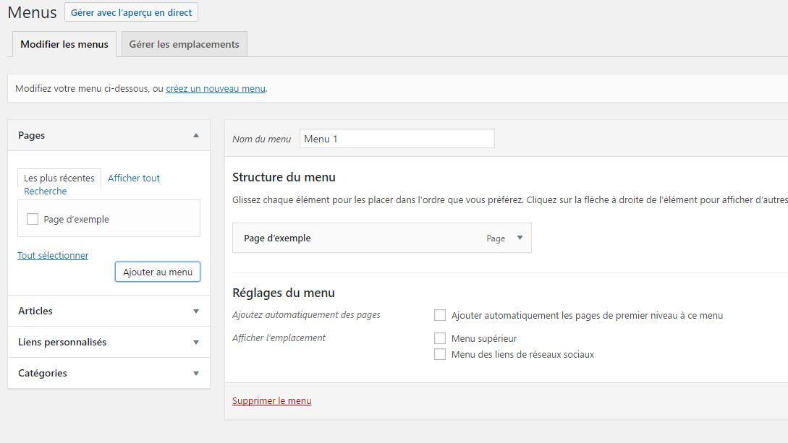
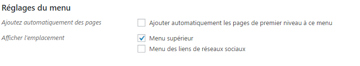

# Menu

Quand vous créez un themes dans WordPress, vous pourrez constater qu'il n'y a pas la possibilité de 
créer et de modifier un menu dans le back-office.




La première chose à effectuer est de signaler à WordPress qu'il y aura un emplacement pour un ou plusieurs menus dans votre theme.
 
 
## Signaler vos emplacements de menus.

Dans le fichier [functions.php](functions.md), ajouter le code ci-dessous :

```
register_nav_menus(
    array(
        'main-menu' => 'Description du menu',
        'footer-menu' => 'Description du menu footer',
    )
);

// Version bootstrap
function add_additional_class_on_li($classes, $item, $args)
{
    $classes[] = 'nav-item';
    return $classes;
}

add_filter('nav_menu_css_class', 'add_additional_class_on_li', 0, 3);

function add_class_a($atts)
{
    $atts['class'] = "nav-link";
    return $atts;
}

add_filter('nav_menu_link_attributes', 'add_class_a', 100, 1);
```

la fonction register_nav_menus() signale à WordPress qu'il y aura des menus.
Cette fonction prend en paramètre un tableau dont les éléments possède une clé et une valeur.

La clé est le nom de l'emplacement du menu.
La valeur est la description de l'emplacement du menu.

Maintenant, vous avez un nouvel onglet dans le back-office :




## Créer votre menu via le backoffice.

- Aller dans le backoffice (l'administration), dans apparence et menu.
- Ecrire le nom de votre menu et cliquer sur créer menu



- Lier vos pages, articles ou catégories à votre menu



- Si vous avez plusieurs emplacement de menu (menu principal et menu footer), selectinner l'emplacement adéquat.



- Cliquer sur enregistrer le menu

## Afficher son menu dans les templates.

Il y a plusieurs manières d'afficher un menu mais je vais vous montrer celle qui utilise wp_nav_menu().

### wp_nav_menu()

wp_nav_menu() va chercher les éléments de votre menu et afficher celui-ci.

```php
     <?php
     $args = array(
         'theme_location' => 'main',
         'container_class' => false,
         'items_wrap' => '%3$s',
         'container' => false,
     );
     wp_nav_menu($args);
     ?>
```

wp_nav_menu() prend plusieurs paramètre mais le plus important est "menu" qui est égale au nom du menu à afficher ou à l'id du menu à afficher ou le slug du menu afficher.

Vous pouvez visualiser mon exemple dans [header.php](../header.php)

Plus plus d'information, [cliquer ici](https://developer.wordpress.org/reference/functions/wp_nav_menu/)


---

[:back:](assets.md) | [:soon:](traduction.md)

