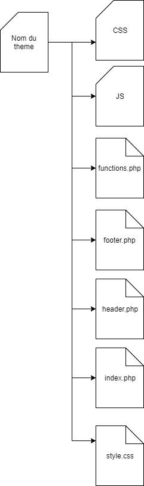

# Arborescence d'un thème WordPress

## Schémas d'une structure de base



## Les fichiers du thème


### [style.css](../style.css)

Le style.css possède les informations liées au thème tels que l’auteur, la version,
le nom du thème, l’URL du thème, etc. Dans ce fichier CSS, il n’y aura aucun style
et il ne sera pas utilisé pour la mise en forme du site.

**Ce fichier est obligatoire!**

Dans le fichier style.css, les valeurs important sont :

Theme Name est égale au nom de votre thème pour l'affichage dans le back-office

Template est égale au nom du dossier où se trouve votre thème.


### [index.php](../index.php)

L’index.php est le template de base dans WordPress, cependant vous pouvez en
créer d’autres en fonction de votre structure de page.

**Ce fichier est obligatoire!**


### [functions.php](../functions.php)

Le functions.php est le controller de votre thème, il se compose des fonctions custom
que vous créez, d’objets que vous allez modifier, de requêtes, etc.

Il permet d’alléger vos vues (templates) en y retirant la logique de
programmation.


### [header.php](../header.php)

L'[header.php](../header.php) contient le header de votre site, les balises html, body et head.
On peut y placer également les balises style, script, etc...

Dans ce fichier, il est important de ne pas oublier la function wp_head() qui permet d'inclure les fichiers CSS, JS et les meta tags propre à WordPress ou aux plugins installés.
Cette function ce place juste avant la fin de la balise </head>

```html
<!DOCTYPE html>
<html <?php language_attributes(); ?> class="no-js">
<head>
	<meta charset="<?php bloginfo( 'charset' ); ?>">
	<meta name="viewport" content="width=device-width">
	<link rel="pingback" href="<?php bloginfo( 'pingback_url' ); ?>">
    <?php wp_head(); ?>
</head>
```


### [footer.php](../footer.php)

L'[footer.php](../footer.php) contient les closures de vos balises body et html. Il peut également contenir vos script, votre footer, etc...

Dans ce fichier, il est important de ne pas oublier la function wp_footer() qui permet d'inclure les fichiers JS propre à WordPress ou aux plugins installés.

Cette function ce place juste avant la fin de la balise body

```html
<?php wp_footer();?>
</body>
</html>
```

Cette function inclut également la barre d'administration, lorsqu'on est connecté au WordPress et que l'on navigue sur le site, cette barre est située au dessus de la page.


### Inclure [header.php](../header.php) et [footer.php](../footer.php)

Afin d'inclure le fichier [header.php](../header.php) dans vos templates, il suffit d'ajouter la function get_header() au début de votre template.

```php
<?php get_header(); ?>
```

Afin d'inclure le fichier [footer.php](../footer.php) dans vos templates, il suffit d'ajouter la function get_footer() à la fin de votre template.

```php
<?php get_footer(); ?>
```


### [screenshot.png](../screenshot.png)

Le screenshot.png est la couverture du thème lors de l’affichage dans la gestion
des thèmes. Ce fichier n’est pas obligatoire mais c’est toujours mieux qu’il soit
présent pour le différencier des autres thèmes installés.


---

[<< Précédent](../README.md) | [Suivant >>](template.md)