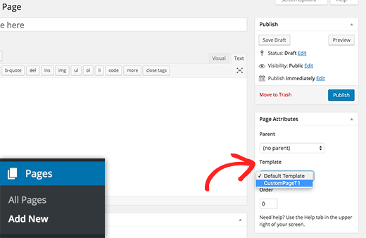

# Les customs templates 

Les customs templates sont souvent créés pour une page en particulier avec une structure spécifique tels que la page contact, la page à propos, etc...
Ils sont situés dans le **dossier** templates et afin qu'ils soient repérer par WordPress, il faut ajouter l'entête ci-dessous dans chaques templates :

```php
<?php
/**
 * Template Name: Contact
 *
 */
```

L'entête est composée du nom du template, exemple Contact.
Pour tester si le template est pris en compte, il faut aller dans le back-office, 
dans le formulaire d'ajout/edition d'une page et un select apparaîtra avec la liste de vos templates 
comme sur l'image ci-dessous.



Si votre template n'est pas repéré par WordPress, veuillez vérifier les espaces entre "Template Name:" et "Contact" car s'il y en a de trop ou trop peu, le template n'est pas pris en compte.


---

[:back:](analyse-template.md) | [:soon:](functions.md)