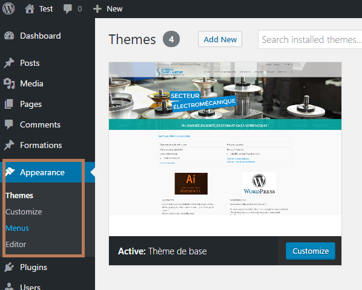
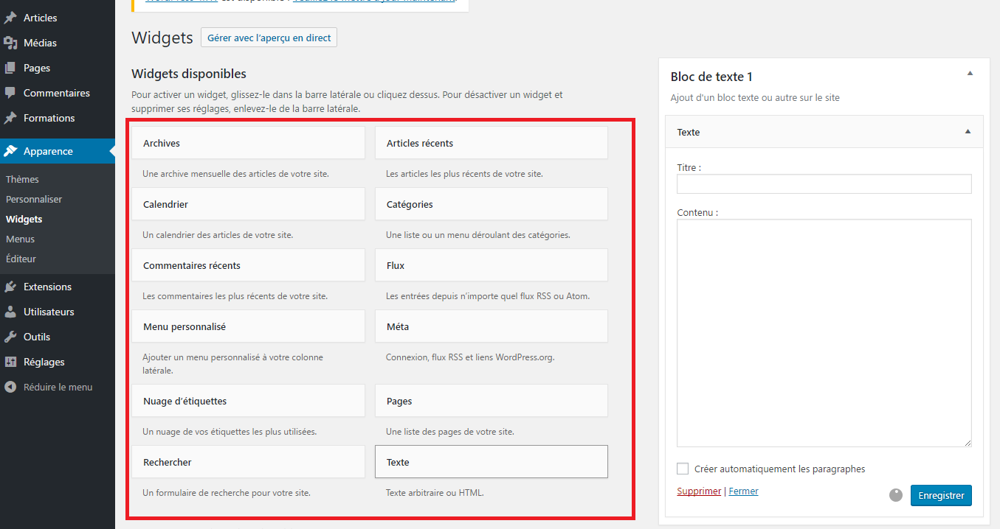
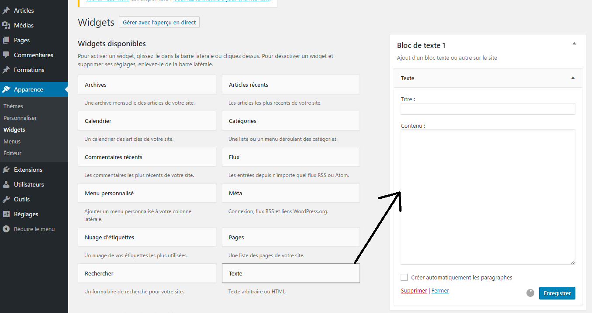
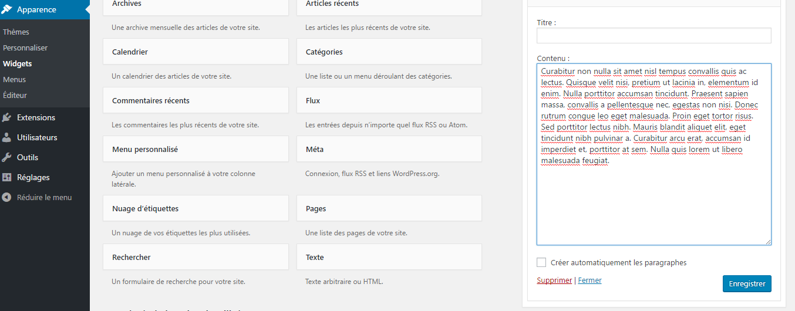
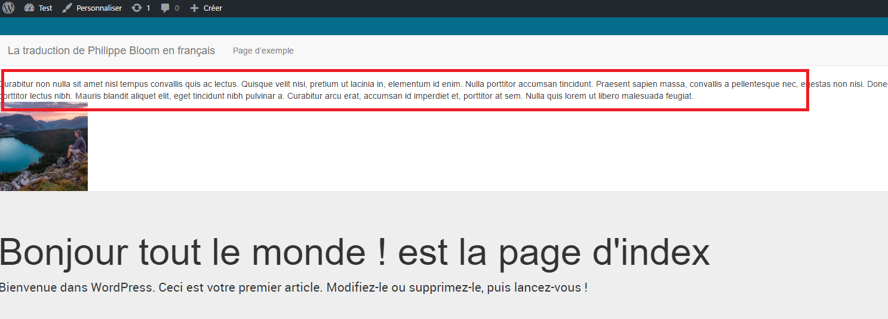

# Les widgets

Les widgets sont des blocs de tout types à placer dans vos templates.
Ils peuvent être un bloc de texte, un bloc de menu, un bloc listant les dernières actualités, etc...

De base, votre theme ne possède pas l'onglet Widget



## Signaler à WordPress vos widgets
 
Dans le fichier [functions.php](../functions.php), inserer le code ci-dessous :

```php
function wp_base_theme_widgets_init() {
    register_sidebar( array(
        'name'          => __( 'Bloc de texte exemple', 'wp-theme-base-translate' ),
        'id'            => 'text-bloc-exemple',
        'description'   => __( 'Ajout d\'un bloc texte ou autre sur le site', 'wp-theme-base-translate' ),
        'before_widget' => '<section id="%1$s" class="widget %2$s">',
        'after_widget'  => '</section>',
        'before_title'  => '<h2 class="widget-title">',
        'after_title'   => '</h2>',
    ) );
}
add_action( 'widgets_init', 'wp_base_theme_widgets_init' );
```

Ce code va signaler à WordPress 10 bloc de texte et dans le back-office, vous constatez qu'il y a un nouvel onglet widgets.
Dans ce nouvel onglet, il y vos bloc de texte.


## Configurer vos blocs de textes (widgets)

- Dans le back-office, dans Apparence, dans l'onglet widgets, faites glisser un bloc de texte qui se trouve à gauche

Il est possible de mettre n'import quel bloc situé à gauche dans vos widgets!



- Vous devez obtenir le résultat suivant



- Taper du texts et cliquer sur enregistrer



## Afficher vos widgets dans vos templates

- placer le code ci-dessous dans un template

```
<?php dynamic_sidebar( 'text-bloc-exemple' ); ?>
```

le paramètre de la fonction dynamic_sidebar() est l'id du widget précédemment signaler

```
'id' => 'text-bloc-exemple',
```

- Visualiser le résultat

J'ai placé le widget dans [index.php](../index.php)




---

[:back:](traduction.md) | [:soon:](../README.md)